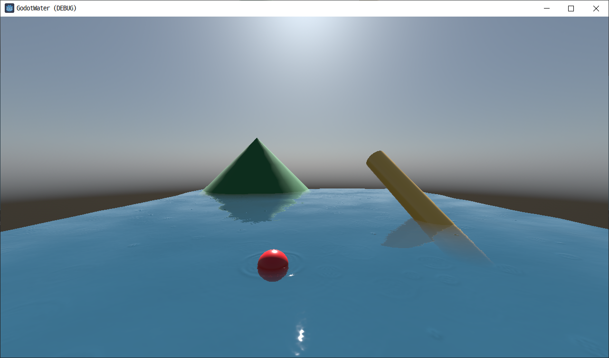

# GodotWaterShader

## Introduction

Godot 4.1 SSR(Screen Space Reflection) Water shader. This project was created to implement water surface in a mobile environment. It runs smoothly on mobile when SSR max travel is 20 to 30. (Tested in Samsung Galaxy S20, 1080p, Forward+, Avg fps:50)

Features :

+ Screen Space Reflection
+ Fake Refraction
+ Proximity fade
+ Bump map
+ Normal Map
+ Texture base Splash Effect : Subviewport detect collisions with 'FloatBody' objects. Water surface repeat collision texture as much as the Subdivision value for performance. Therefore, if the Subdivision is greater than 1, Camera must be adjusted well to prevent repeated textures from being visible.
+ Rain Effect

## Usage

Load the project in Godot 4.1 (or possibly later).

## Reference
+ https://github.com/marcelb/GodotSSRWater#what-is-this-about
+ https://github.com/CBerry22/Godot-Water-Ripple-Simulation-Shader
+ Godot Engine SSR source code
